# VS Code Maximo Development Tools

Deploy [Maximo Automation Scripts](https://www.ibm.com/docs/SSLLAM_7.6.0/com.ibm.mbs.doc/autoscript/c_automation_scripts.html) and Maximo screen definitions directly from Visual Studio Code.

The extension allows developers to describe the automation script through the use of a `scriptConfig` variable and then deploy the script directly to Maximo from Visual Studio Code. The provided `SHARPTREE.AUTOSCRIPT.DEPLOY` automation script provides support for build pipelines and automated deployment of automation scripts from a Git repository. 

# Configuration
## Visual Studio Code Settings
After installation you must provide connection details for your target instance of Maximo. The connection settings are found in the VS Code Settings (`⌘ + ,` or `ctrl + ,`) under the `Maximo` heading. The table below provides a list of the available settings.

### Maximo Settings
The following are settings available under the `Sharptree > Maximo` group.

| Setting                              | Default               | Description                                                                                                                                                                   |
| :------------------------------------| :---------------------| :-----------------------------------------------------------------------------------------------------------------------------------------------------------------------------|
| Allow Untrusted Certs                | false                 | When checked, ignores SSL validation rules.                                                                                                                                   |
| API Key                              |                       | The Maximo API key that will be used to access Maximo. If provided, the user name and password are ignored if configured.                                                     |
| Context                              | maximo                | The part of the URL that follows the hostname, by default it is `maximo`.                                                                                                     |
| Custom CA                            |                       | The full chain for the server CA in PEM format.                                                                                                                               |
| Extract Inspection Forms Location    | Current open folder   | Directory where extracted inspection files will be stored.  
| Extract Location                     | Current open folder   | Directory where extracted script files will be stored.                                                                                                                               |
| Extract Screen Location              | Current open folder   | Directory where extracted screen XML files will be stored.                                                                                                                               |
| Host                                 |                       | The Maximo host name *without* the http/s protocol prefix.                                                                                                                    |
| Maxauth Only                         | false                 | Both Maxauth and Basic headers are usually sent for login, however on WebLogic if Basic fails the Maxauth header is ignored. When checked, only the Maxauth header is sent.   |
| Port                                 | 443                   | The Maximo port number, 80 for http, 443 for https or your custom port such as 9080.                                                                                          |
| Timeout                              | 30                    | The time in seconds to wait for Maximo to respond.                                                                                                                            |
| User                                 |                       | The user that will be used to connect to Maximo.                                                                                                                              |
| Use SSL                              | true                  | When checked, SSL will be used, the provided port must be configured for SSL                                                                                                  | 

> The Authentication Type setting has been removed and replaced with automatic detection of authentication type.

### .devtools-config.json
A file named `.devtools-config.json` can be created in the root directory of the project folder to override the VS Code settings. This file is a JSON formatted and contains the setting attributes to override, any settings not included in the file will be taken from the VS Code settings. 

The `password` and `apiKey` attributes will be automatically encrypted on first use. If the `password` or `apiKey` needs to be updated, the encrypted value can be replaced with the new plain text value, which will again be automatically encrypted on first use.

### Sample
```json
{
    "host":"The Maximo host name",
    "port":80|443,
    "context":"maximo",
    "useSSL":true|false,
    "username":"The Maximo username",
    "password":"The Maximo user's password",
    "apiKey":"A Maximo API key",
    "allowUntrustedCerts":true|false,
    "timeout":30,
    "ca":"A PEM formatted CA",
    "maxauthOnly":true|false,
    "extractLocation":"Path to the script extract directory",
    "extractLocationScreens":"Path to the screens extract directory",
    "extractLocationForms":"Path to the forms extract directory"
}
```
> Since `.devtools-config.json` may contain sensitive connection information it should *never* be checked into Git. A `.gitignore` entry for `.devtools-config.json` is automatically created the first time the `.devtools-config.json` is used by the extension to ensure that it is not accidentally included in a commit.

### Logging Settings
The following are settings available under the `Sharptree > Maximo > Logging` group.

| Setting                   | Default               | Description                                                                                                                                                                   |
| :-------------------------| :---------------------| :-----------------------------------------------------------------------------------------------------------------------------------------------------------------------------|
| Append                    | true                  | When checked, appends to the current log file.                                                                                                                                |
| Follow                    | true                  | When checked, if the current log is displayed in the editor the cursor will remain at the end of the file.                                                                    |
| Open Editor On Start      | true                  | When checked, opens the log file editor when logging is started.                                                                                                              |
| Output File               |                       | The absolute or relative path to the log file.  If using a relative path, it will be relative to the current open folder.                                                     |
| Timeout                   | 30                    | The number of seconds between requests for the log file, this should be less than the connection timeout.                                                                     |


## Maximo Configuration
The very first time you connect to Maximo, this extension will add several required automation scripts to Maximo. To deploy these scripts, the extension requires that you be in the Maximo Administrators group and have access to the `MXSCRIPT` object structure. To perform the configuration, bring up the Visual Studio Code Command Palette (`View > Command Palette...` or `⌘ + shift + p` or `ctrl + shift + p`) and select `Deploy Automation Script`. You will be prompted for a password and then a dialog will be displayed prompting you to configure Maximo.


Click the `Yes` button to proceed. The configuration should take less than a minute and a progress indicator will be displayed in the bottom right of the screen.


Upon completion a dialog will be displayed confirming the configuration was successful.

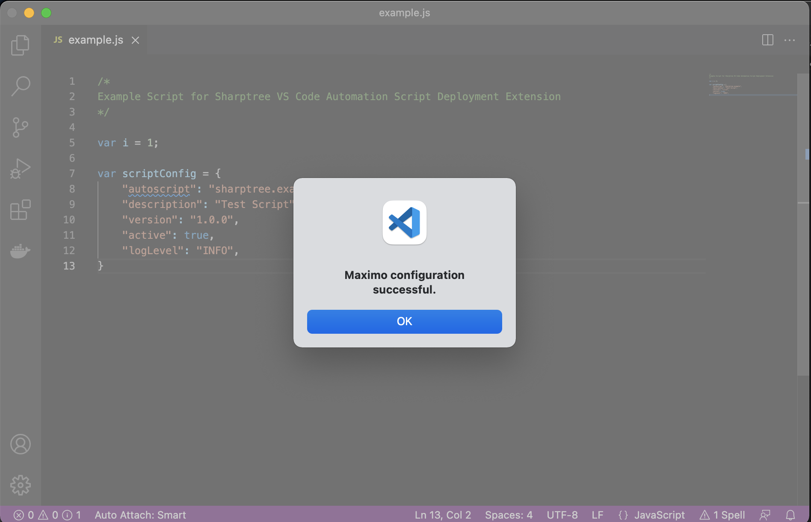

The extension is now ready to deploy automation scripts. After the initial configuration, any user that is in the Maximo Administrators group or has been granted the `Deploy Automation Script` permission under the `SHARPTREE_UTILS` object structure as shown below can deploy scripts from Visual Studio Code.

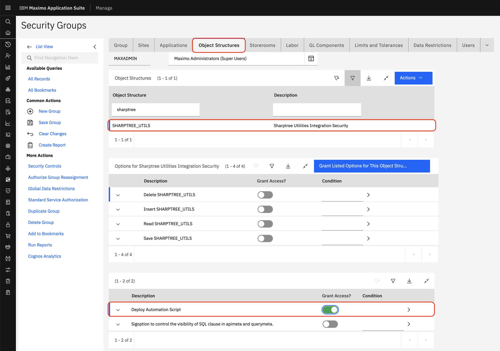

For log streaming, any user that is in the Maximo Administrators group or has been granted the `Stream Log` permission under the `LOGGING` application as shown below, has access to stream the Maximo log to Visual Studio Code.

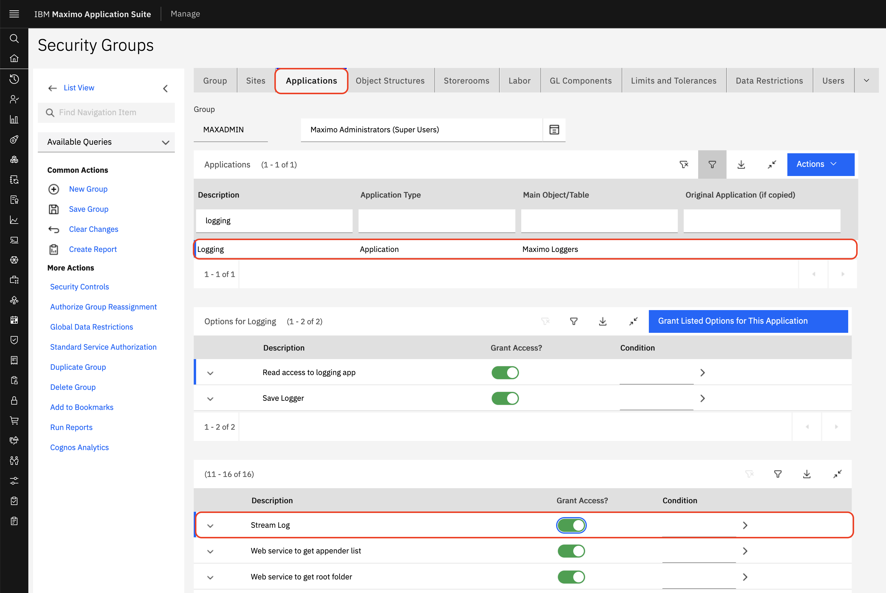


### Maximo Configuration Details
As part of the configuration, an integration object named `SHARPTREE_UTILS` is created and the automation scripts listed below are also created.

| Script                                | Description                                                                                                       |
| :-------------------------------------| :-----------------------------------------------------------------------------------------------------------------|
| SHARPTREE.AUTOSCRIPT.DEPLOY           | The primary script used for deploying and managing automation scripts.                                            |
| SHARPTREE.AUTOSCRIPT.DEPLOY.HISTORY   | Created after the first script is deployed. Contains a JSON with a history of all scripts deployed.               |
| SHARPTREE.AUTOSCRIPT.STORE            | Script for managing the storage of the deploy history.                                                            |
| SHARPTREE.AUTOSCRIPT.EXTRACT          | Script for extracting scripts from Maximo.                                                                        |
| SHARPTREE.AUTOSCRIPT.LOGGING          | Script for streaming the Maximo log.                                                                              |
| SHARPTREE.AUTOSCRIPT.SCREENS          | Script for managing Maximo screen definitions.                                                                    |

## scriptConfig Variable
Each script must define a variable named `scriptConfig` that is a JSON object describing how to deploy the script. The extension uses these values to populate the corresponding values of the `AUTOSCRIPT` and `SCRIPTLAUNCHPOINT` Maximo Business Objects. At a minimum the `autoscript` attribute is required, all other attributes are optional.  All configuration attributes are available and are defined by their label name without spaces, in camel case.  The example below provides the basic structure.

A `properties`, `maxvars`, or `messages` property may be included within the `scriptConfig`. Each of these is a JavaScript array (enclosed in brackets `[]`), of objects with each property corresponding to the Maximo attribute name for the value.  Each value in the array will create or update a Maximo `property`, `maxvars`, or `message`.  A special property of `"delete":"true"` can be specified to delete a `property`, `maxvar`, or `message` in the target system. For a `property` entry a property of `initialPropValue` can be provided to set the initial value of the property if it does not already exist in the system.

All value names within the `scriptConfig` map to the application label, without spaces and in camel case. For example if the label in the application is `Before Save` the corresponding value name is `beforeSave`.

### On Deploy Properties
There are three options for triggering script actions when a script is deployed. The `onDeploy` property can be defined with a value specifying the name of a function within in the deployed script that will be called when the script is deployed, the `onDeployScript` property can be defined with the name of another script that will be invoked when the the current script is deployed or if a script with the same name as the current script with `.DEPLOY` appended to the name exists, it will be automatically invoked. The deploy script will automatically be delete after execution unless the `deleteDeployScript` property is set to `false`.

The following four global variables are provided to the deployment scripts.

| Variable         | Type |    Description                                                                                                                          |
| :----------------| :-----------------------------------------------| :--------------------------------------------------------------------------------------------|
| onDeploy         | boolean                                         | Variable that can be checked within a script to determine if it is being run at deploy time. |
| request          | com.ibm.tivoli.maximo.oslc.provider.OslcRequest | The OslcRequest object for the process deploying the script.                                 |
| service          | com.ibm.tivoli.maximo.script.ScriptService      | The standard service class provided to all automation scripts.                               |
| userInfo         | psdi.security.UserInfo                          | The UserInfo object for the current user.                                                    |

When using a script for deploy actions, that script file may be named the same as the primary script with `-deploy` appended to the file name and with the same extension to have it automatically deployed with the primary script.  For example if a script is contained in a file named `example.js` the deployment script can be saved in a file named `example-deploy.js` and the deployment script will be deployed to Maximo first so it is available to be called by the primary script at deploy time. 

> Maximo requires that JavaScript objects have quoted properties, as shown below.  If you are using Prettier as your code formatter it may automatically remove these quotes, which will result in errors when deploying.  To retain the quotes go to the Visual Studio Code Settings (`⌘ + ,` or `ctrl + ,`), select `Prettier`, then find the `Quote Props` setting and select the `preserve` option.  
>
> 
> 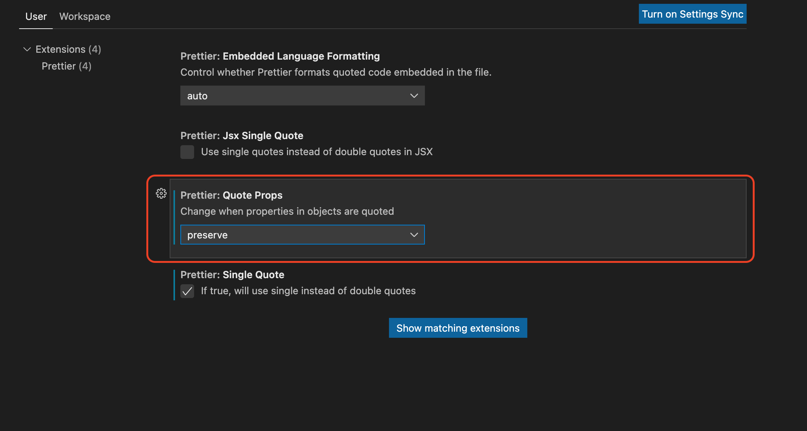

### JavaScript / Nashorn Example
```javascript
main();

function main(){
    // entry point for the script.
}

var scriptConfig = {
    "autoscript":"EXAMPLE_SCRIPT",
    "description":"An example script for deployment",
    "version":"1.0.4",
    "active":true,
    "logLevel":"INFO",
    "autoScriptVars":[
        {
            "varname":"examplevar",
            "description":"An example variable"
        }
    ],
    "scriptLaunchPoints":[
        {
            "launchPointName":"EXAMPLELP",
            "launchPointType":"OBJECT",
            "description":"An example launch point for Labor",
            "objectName":"LABOR",
            "save":true,
            "add":true,
            "update":true,
            "beforeSave":true,
            "launchPointVars":[
                {
                "varName":"examplevar",
                "varBindingValue":"Example binding"
                }
            ]
        }
    ],
}

```

### Python / Jython

For Python / Jython scripts the same JSON script configuration is used, just triple quote it as a `string` value.

```python

def main():
    # entry point for the script.

main()    

scriptConfig = """{
    "autoscript":"EXAMPLE_SCRIPT",
    "description":"An example script for deployment",
    "version":"1.0.4",
    "active":true,
    "logLevel":"INFO",
    "autoScriptVars":[
        {
            "varname":"examplevar",
            "description":"An example variable"
        }
    ],
    "scriptLaunchPoints":[
        {
            "launchPointName":"EXAMPLELP",
            "launchPointType":"OBJECT",
            "description":"An example launch point for Labor",
            "objectName":"LABOR",
            "save":true,
            "add":true,
            "update":true,
            "beforeSave":true,
            "launchPointVars":[
                {
                "varName":"examplevar",
                "varBindingValue":"Example binding"
                }
            ]
        }
    ],
}"""

```

# Features
## Deploy to Maximo
To deploy a script, screen definition or inspection form, open script, screen definition or inspection form extract in Visual Studio Code, then bring up the Visual Studio Code Command Palette (`View > Command Palette...` or `⌘ + shift + p` or `ctrl + shift + p`) and select `Deploy to Maximo`. If this is the first time deploying a script or screen definition after starting Visual Studio Code you will be prompted for your Maximo password as this extension does not store passwords. The script or screen definition is then deployed as seen below.

### Deploy Script
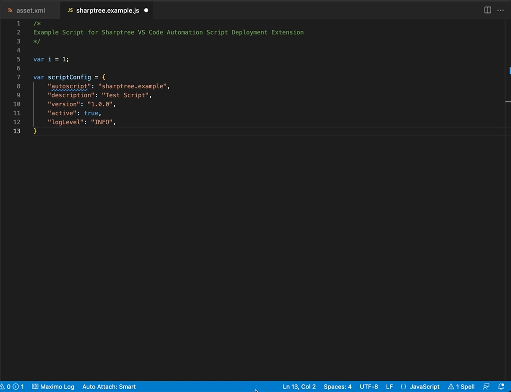

When deploying an automation script, after the script has been deployed you can view the script in Maximo. Each deployment replaces the script launch point configuration with the configuration defined in the `scriptConfig` JSON.


### Deploy Screen


### Deploy Inspection Form


When deploying an inspection form the form is matched based on the inspection form name, not the inspection number since it may differ between the source and target systems. If the form already exists the current form is revised and the form definition completely replaces the previous configuration. The option attribute `activateOnDeploy` can be specified in the inspection form JSON to indicate that the new revision should be marked as active when the form is deployed.

> The `sourceVersion` attribute indicates the version of the source system. Inspection forms are portable between versions as long as the target system is the same or a later version than the source. 

## Extract Automation Scripts
To extract the scripts currently deployed to Maximo, bring up the Visual Studio Code Command Palette (`View > Command Palette...` or `⌘ + shift + p` or `ctrl + shift + p`) and select `Extract All Automation Scripts`. The extension will query Maximo for the available scripts and then prompt for confirmation to extract the scripts as shown below. Scripts are saved to the directory specified in the `Extract Location` setting. If the setting has not been configured, the scripts are extracted to the current workspace folder.


To extract a single script, bring up the Visual Studio Code Command Palette (`View > Command Palette...` or `⌘ + shift + p` or `ctrl + shift + p`) and select `Exact Automation Script`.  The extension will query Maximo for the available scripts and display them in a searchable quick pick list. Select the script to extract from the list and the extension will extract it to the directory specified in the `Extract Location` setting. If the setting has not been configured, the script is extracted to the current workspace folder.

## Extract Screen Definitions
To extract the screens from Maximo, bring up the Visual Studio Code Command Palette (`View > Command Palette...` or `⌘ + shift + p` or `ctrl + shift + p`) and select `Extract All Screen Definitions`. The extension will query Maximo for the available screens and then prompt for confirmation to extract the screens as shown below. Screens are saved to the directory specified in the `Extract Screen Location` setting. If the setting has not been configured, the screen definitions are extracted to the current workspace folder.


To extract a single screen, bring up the Visual Studio Code Command Palette (`View > Command Palette...` or `⌘ + shift + p` or `ctrl + shift + p`) and select `Exact Screen Definition`.  The extension will query Maximo for the available screens and display them in a searchable quick pick list. Select the screen to extract from the list and the extension will extract it to the directory specified in the `Extract Screen Location` setting. If the setting has not been configured, the screen is extracted to the current workspace folder.

> The screen definition XML is consistently formatted when extracted to assist with comparison.  To ensure the formatting remains consisted, when using the standard XML formatter ensure that the `Space Before Empty Close Tag` is unchecked.
> 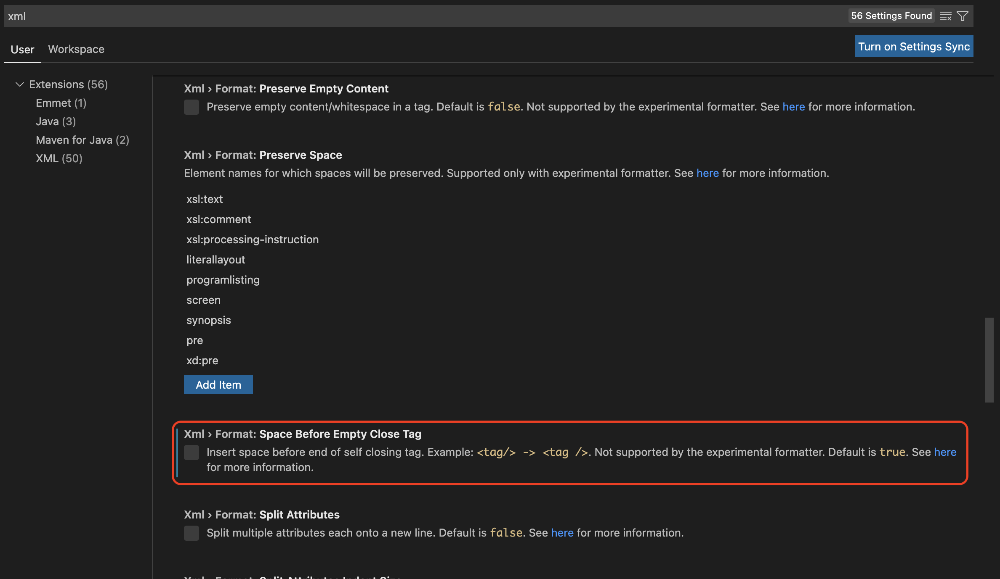

### Extracted Metadata
As of version 1.6.0 extracted screens will include a `metadata` tag that contains the conditional properties configuration. It also includes the security group and condition definitions that support creating the security group if it doesn't exist and creating *or* updating the conditional expressions. The `metadata` tag is removed as part of the import process and will error if you attempt to import the exported presentation XML through the front end user interface.

## Extract Inspection Forms
To extract inspection forms from Maximo, bring up the Visual Studio Code Command Palette (`View > Command Palette...` or `⌘ + shift + p` or `ctrl + shift + p`) and select `Extract All Inspection Forms`. The extension will query Maximo for the latest inspection forms and then prompt for confirmation to extract the inspection forms as shown below. Inspection forms are saved to the directory specified in the `Extract Inspection Forms Location` setting. If the setting has not been configured, the inspection forms are extracted to the current workspace folder. The extract files are named with the inspection form name, with dashes `-` replacing spaces and with a `.json` file extension.

> The extract includes the source inspection form and revision number. Note that these values are for reference purposes only and a new inspection form and revision number will be generated in the target system.

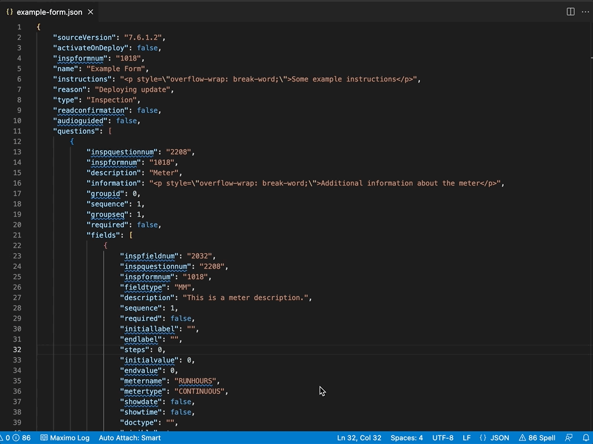

To extract a single inspection form from Maximo, bring up the Visual Studio Code Command Palette (`View > Command Palette...` or `⌘ + shift + p` or `ctrl + shift + p`) and select `Extract Inspection Form`. The extension will query Maximo for the latest inspection forms and display them in a searchable quick pick list. Select the form to extract from the list and the extension will extract it to the directory specified in the `Extract Inspection Forms Location` setting. If the setting has not been configured, the form is extracted to the current workspace folder.

## Compare with Maximo
To compare the current script or screen definition with the script or screen on the server, bring up the Visual Studio Code Command Palette (`View > Command Palette...` or `⌘ + shift + p` or `ctrl + shift + p`) and select `Compare with Maximo`. The extension will query Maximo for the current script or screen that is in the editor based on the `scriptConfig` variable or `<presentation id=""` attribute and open a new window, providing the Visual Studio Code diff editor.

### Compare Script
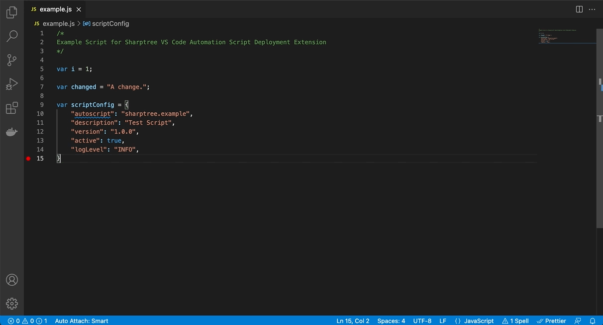

### Compare Screen
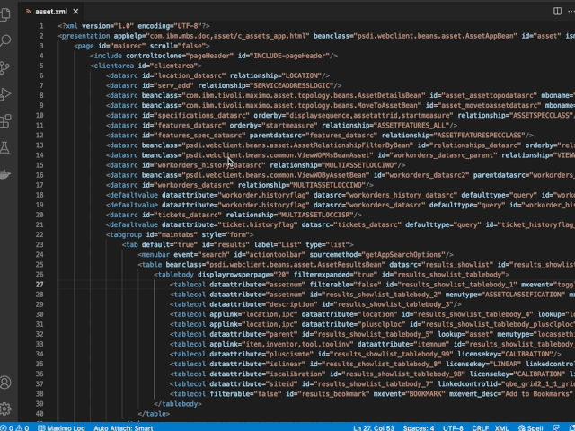

## Log Streaming
To stream the Maximo log to a local file click the `Maximo Log` status bar item to toggle streaming.  The rotating status icon indicates that the log is currently streaming.

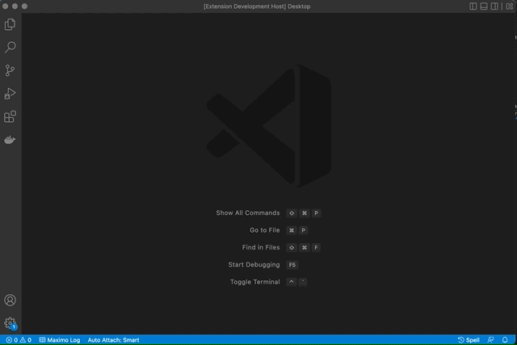

## Insert Unique Id
When editing a screen definition XML, ensuring that the `id` attribute is unique can be annoying, especially when copying and pasting sections of the screen. Maximo generates unique `id` attribute values based on the current time since epoch in milliseconds and now you can too.

To insert or update the `id` attribute of a tag to the unique value of the current time in milliseconds since epoch, bring up the Visual Studio Code Command Palette (`View > Command Palette...` or `⌘ + shift + p` or `ctrl + shift + p`) and select `Insert Unique Id for Maximo Presentation Tag` or press `ctrl + ⌘ + i` or `ctrl + alt + i`).

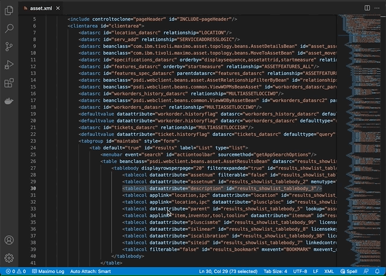

## Snippets
The Maximo Development Tools extension provides snippets for all the built in classes including the majority of methods on the `mbo`, `service` and `userInfo` built in objects. While not providing a full language server it should provide a majority of common methods on the implicit variables. 

There are also snippets for common functions such as a `close` function or the `scriptConfig` variable.  If there are any additional snippets you would like added please contact us at  [hello@sharptree.io](mailto:hello@sharptree.io).

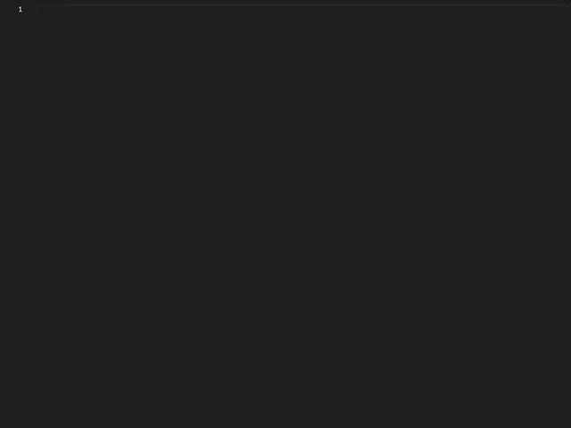

Pressing `ctrl+space` will bring up help information for each snippet, describing what the snippet does with information about the parameters.


# Requirements

- Maximo 7.6.0.8 or higher, Maximo Application Suite 8 is supported.
- Files must have a `.js` of `.py` extension for scripts, `xml` for screens and `json` for inspection forms.
- This extension requires Maximo to support Nashorn scripts, which requires Java 8.
- Initial configuration must be done by a user in the administrative group defined by `ADMINGROUP` `MAXVARS` entry. Typically this is `MAXADMIN`.